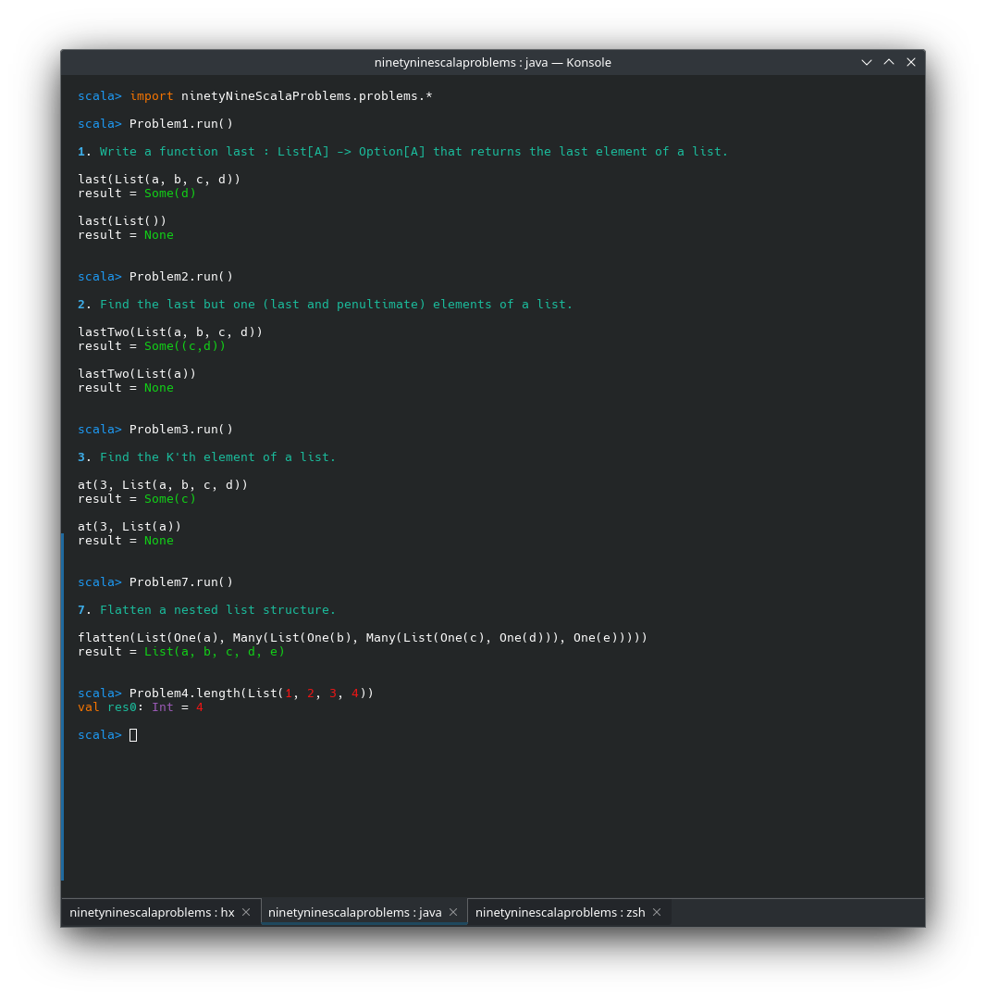

<h1 align="center">99 Scala Problems</h1>
<p align="center">An adaptation of the <a href="https://v2.ocaml.org/learn/tutorials/99problems.html">99 Problems in OCaml</a> for Scala.</p>
<p align="center">
  <a href="https://www.scala-lang.org/">
    
  </a>
</p>

## How to run

You will need a standard Scala 3 development environment to run this project: JDK >= 11, Scala >= 3.4.0 and Sbt >= 1.9.9.

The first step is clone this repository and enter on the sbt console:

```bash
git clone https://github.com/Mth-Ryan/ninetyNineScalaProblems
cd ninetyNineScalaProblems
sbt console
```
Within the console you can import the `ninentaNineScalaProblems.problems` package and run the predefined examples
or use the implemented functions and structures to solve the problem. See some examples:



